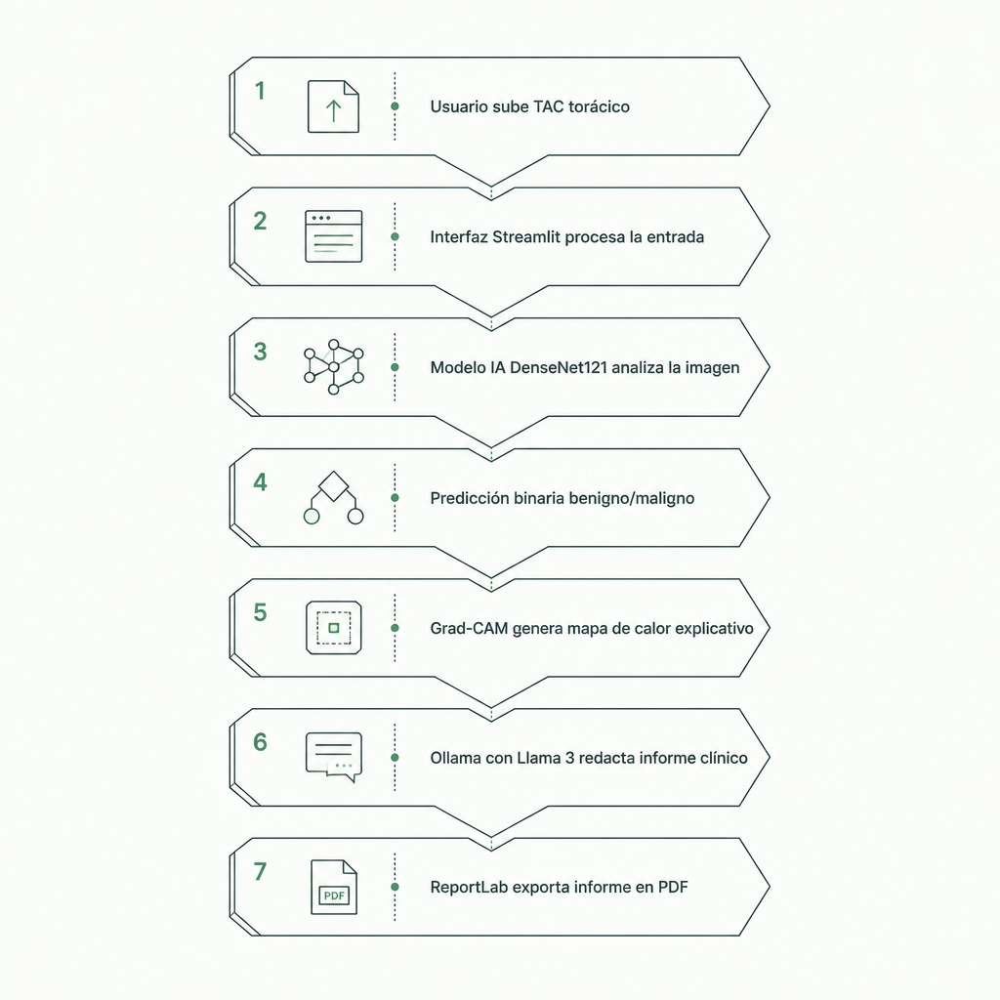

# LungVision🫁AI

> **Plataforma para la detección de cáncer pulmonar mediante Inteligencia Artificial a partir de TACs torácicos**


 


---

## 📋 Descripción del Proyecto

**LungVisionAI** es un sistema inteligente diseñado para asistir a profesionales de la salud en la clasificación de tomografías axiales computarizadas (TAC) de tórax. 
La aplicación utiliza un modelo el cual se encarga de:
- Analizar automáticamente TACs torácicos en busca de detectar o rechazar la presencia de anomalías cancerígenas con una alta probabilidad (*ej. CÁNCER - Confianza: 99.81%*).
- Generación de mapas de calor Grad-CAM para resaltar las regiones de interés en las que el modelo enfoca su predicción.
- Generación automática de informes en PDF con hallazgos, interpretación radiológica, recomendaciones y advertencias legales reduciendo así tiempos de documentación.

---

## 🏛️ Arquitectura del Sistema


<table width="100%">
  <tr>
    <td width="45%" style="padding: 0px; vertical-align: stretch;">
      
    </td>
    <td width="55%" valign="top" style="padding-left: 20px;">
      <ol>
        <li><b>Usuario sube TAC torácico:</b> Se introduce la imagen médica en la plataforma.</li>
        <br>
        <li><b>Interfaz Streamlit procesa la entrada:</b> Se valida el archivo y se aplican las transformaciones necesarias (redimensionado a 224x224, normalización y formato RGB).</li>
        <br>
        <li><b>Modelo IA DenseNet121 analiza la imagen:</b> La CNN procesa las características del TAC.</li>
        <br>
        <li><b>Predicción binaria (Benigno/Maligno):</b> Se computa la probabilidad de presencia de cáncer o tejido normal.</li>
        <br>
        <li><b>Grad-CAM genera mapa de calor explicativo:</b> Se identifican y resaltan visualmente las regiones críticas que justifican el diagnóstico.</li>
        <br>
        <li><b>Ollama con Llama 3 redacta informe clínico:</b> El modelo de lenguaje redacta el reporte estructurado en texto natural.</li>
        <br>
        <li><b>ReportLab exporta informe en PDF:</b> Generación del documento final descargable para el profesional.</li>
      </ol>
    </td>
  </tr>
</table>


---

## 📊 Muestra de Resultados (DEMO)

La aplicación genera reportes médicos completos que incluyen los mapas de activación visual y el análisis del modelo:


</details>

---
## 🚀 Instalación y Ejecución Local

### Requisitos previos

* **Python 3.9** o superior
* **Git** instalado
* **Ollama** instalado localmente (con el modelo `llama3` descargado)

---

### Pasos de Instalación

1. **Clonar el repositorio:**
   ```bash
   git clone [https://github.com/pcasta11/LungVisionAI.git](https://github.com/pcasta11/LungVisionAI.git)
   cd LungVisionAI

2. Crear y activar un entorno virtual
Se recomienda el uso de un entorno virtual para aislar las dependencias:

En Windows (PowerShell/CMD):

Bash
python -m venv venv
.\venv\Scripts\activate
En macOS / Linux:

Bash
python3 -m venv venv
source venv/bin/activate
3. Instalar dependencias
Con el entorno virtual activo, instala todas las librerías necesarias:
